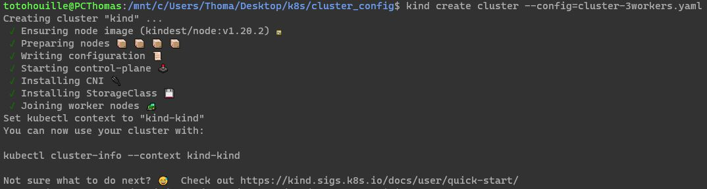
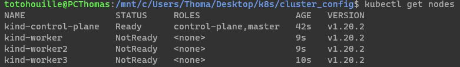
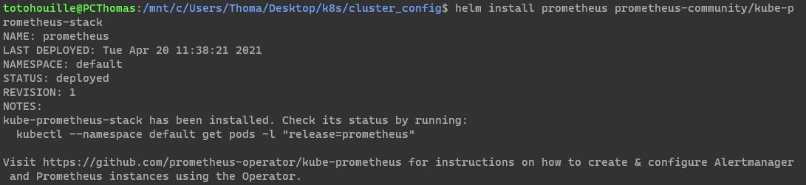
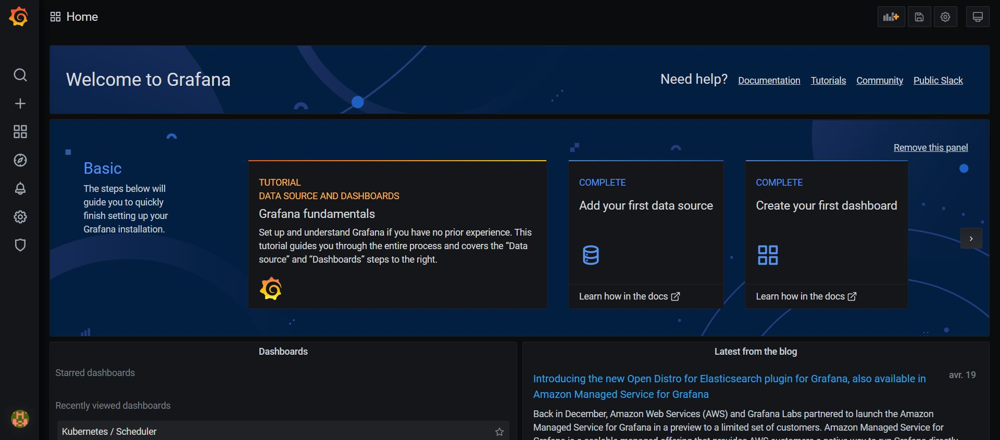
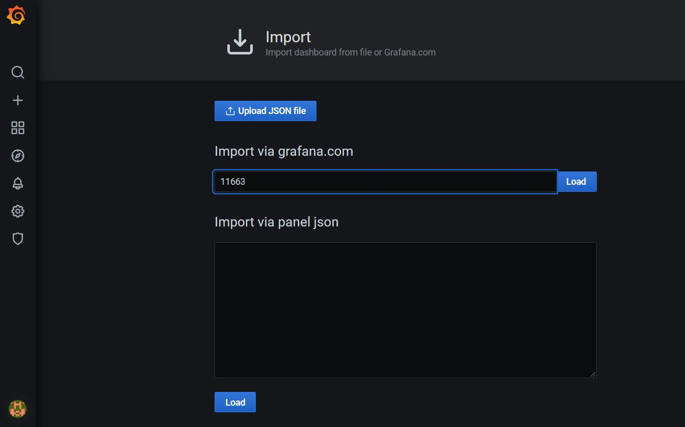
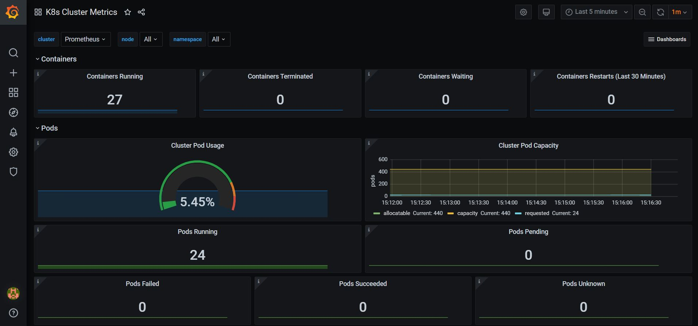

# How to create a Kubernetes cluster supervised by Prometheus with Kind

## Create a 3 worker nodes cluster

In order to create a virtual kubernetes cluster on your personal machine, you'll need to have Kind. Once Kind is installed on your machine, you have to create a 3 worker nodes cluster.
Create a file named ``kind_cluster.yaml`` and copy paste the following text:

```shell
# three node (two workers) cluster config
kind: Cluster
apiVersion: kind.x-k8s.io/v1alpha4
nodes:
- role: control-plane
- role: worker
- role: worker
- role: worker
```

Save the file and let's create the cluster with the following command:

```shell
kind create cluster --config=kind_cluster.yaml
```




The kubernetes cluster is created, you can check its good health with the following command :

```shell
kubectl get nodes
```




## Install Prometheus with Helm

In order to install Prometheus, you'll have to download Helm which is a usefull tool developped to install Kubernetes packages. According to Helm official documentation, you can download Helm with the following command lines:

```shell
curl -fsSL -o get_helm.sh https://raw.githubusercontent.com/helm/helm/master/scripts/get-helm-3
chmod 700 get_helm.sh
./get_helm.sh
```

The next step is to install a Prometheus operator with Helm. But first, we need to initialize helm repositories with the following command lines :
```shell
helm repo add prometheus-community https://prometheus-community.github.io/helm-charts
helm repo add stable https://kubernetes-charts.storage.googleapis.com/
helm repo update
```

Now, you can install the Prometheus operator :

```shell
helm install prometheus prometheus-community/kube-prometheus-stack
```




Congratulations, you have a Prometheus opeartor running in your cluster!


## Use Grafana 

A grafana component was installed with the Prometheus operator. To use it, you have to make the service available on one of your machine port (3000 in this case) : 
```shell
kubectl port-forward deployment/prometheus-grafana 3000
```
let your terminal run this command.
To access Grafana UI, go on a web browser with URL ```localhost:3000```. The id is ``admin`` and the password is ``prom-operator``.



Once you're in Grafana, you can inspect many things. A good start is to import a kubernetes dashboard to visualize your custer metrics. Go on the + icon and import. There, import the dashboard ```11663``` and load it.




To access the freshly imported dashboard, go on the loupe icon and there you should see ```k8s Cluster Metrics``` which is the dashboard.




